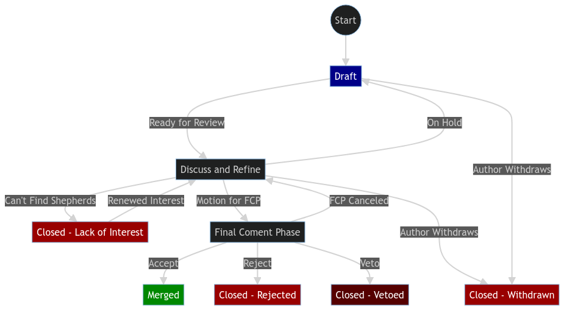

# HyprWM RFCs (Request for Comments)

Welcome to the RFC (Request for Comments) repository for HyprWM. Here you may
propose, discuss and track changes to various aspects of the HyprWM organization
including, but not limited to, community structure, project features, packaging
and security of projects.

## What is an RFC?

RFC stands for Request for Comments. It's a formalized way to propose
significant changes, new features, or enhancements to a project. The purpose of
an RFC is to solicit feedback and build consensus around proposed changes before
they are implemented.

## Motivation

The purpose of the RFC process is to provide a structured and collaborative
process for proposing and discussing significant changes, new feature additions
or enhancements to HyprWM projects. By implementing and normalizing the RFC
process, we aim to:

- Encourage participation: Provide a platform for all community members to
  contribute ideas and feedback.
- Foster consensus: Facilitate discussions to build agreement and alignment
  around proposed changes before they are implemented.
- Improve transparency: Document proposals, discussions, and decisions to keep
  the community informed about the direction of HyprWM projects.
- Enhance quality: Ensure that proposed changes undergo proper review and
  consideration alongside healthy communication before implementation, hopefully
  leading to higher-quality outcomes than hastily done merges.

RFC documents are intended as the permanent documentation of a decision and a
snapshot of a moment in time, rather than a specification-like normative
document. The goal of the RFC process is to concentrate relevant discussion in
one location that can be easily archived and viewed.

## When this process is followed

The RFC process is followed when one intends to propose large changes to
projects under the HyprWM umbrella. The "large changes" in question may be
redefined in time, as the community evolves, but for the time being the
following are included:

- Broad changes to the documentation
- Semantic or syntactic changes to, e.g., Hyprlang
- Large restructures of the community mediums (Discord, Matrix, ...)
- Nix tooling and packaging
- Expansions of the scope of HyprWM (new projects, packaging, ...)
- Introduction of new interfaces to existing projects

Certain topics of interest, regardless of how many RFCs are submitted, will not
be subject to change:

- The project language (C++)
- The project owner ([@vaxerski](https://github.com/vaxerski))

Other changes, while difficult, may be subject to change if a compelling
argument is made:

- Build system (CMake)
- Wiki software
- Code style

## Glossary

### RFC Steering Committee

A group of members assigned by the
[Core HyprWM Team](https://github.com/orgs/hyprwm/teams/core) which would stay
consistent until the team composition is potentially changed through an RFC
proposal. This committee is tasked with forming an RFC Shepherd team from the
available nominations on each new RFC. The responsibilities of this team also
include naming a "leader" for the shepherd team during its life-cycle. This
**must** happen within 2 weeks after the Pull Request to the RFCs repository has
been opened. Until a leader has been assigned, the Steering Committee will also
be held responsible for guiding all discussions under the relevant pull request.

In case of the Shepherding Team not doing its work as expected, the Steering
Committee shall encourage them [to do so] or step in to assign a new Shepherd
team that may or may not include previous teams. They will also be in charge of
marking the end of an RFC discussion period (i.e. merging or rejecting) the RFC.

Current RFC Steering Committee consists of:

- TBD
- TBD
- TBD
- ...

### Shepherd Team

A team of 2-4 community members, defined unanimously by the RFC Steering
Committee, tasked with marking the end of an RFC's life-cycle by marking it for
either merge or rejection. This team is formed during each RFC's life-cycle, and
for the relevant RFC only from community members nominated in the discussion of
that RFC.

This team shall be people who are very familiar with the components that are the
main subjects of the RFC, and the author may not be a part of the Shepherd Team.
In addition to the previous restrictions, at least one and at most half of the
Shepherd Team shall be part of the RFC Steering Committee.

The responsibility of the team is to guide and moderate the discussion as long
as it is constructive, brings new points to the table and while the RFC is
iterated and circled-back to from time to time. If this is no longer the case,
the Shepherd Team shall decide on whether to proceed with the FCP.

#### Shepherd Leader

The Shepherd Leader refers to the person in charge of the RFC process for a
specific RFC, with the responsibility of ensuring that the process is followed
in a neat, timely and civil fashion. This person has no special responsibility
with regard to moving an undecided Shepherd Team to a certain decision.

### Final Comment Period (FCP)

A period of 8 calendar days, which will be called by the Shepherd Team after the
RFC has received the proper amount of discussion appropriate to the size of the
RFC, and enough of the pros and cons of said RFC have been discussed. The
Shepherd Team will propose to either accept, or reject the RFC once the FCP
period is concluded.

## Process from Creation to Merge

_In short, to get a major change propagated to the HyprWM organization or to a
project under the HyprWM organization, one must first get an RFC merged into the
RFC repository as a markdown file under the `rfcs` directory, with the file name
`XXXX-<name>.md` where the `XXXX` in the name stands for the RFC number,
starting from `0000`. A template is available in the root of this repository. At
that point the RFC is accepted, and may be implemented with the goal of eventual
inclusion into HyprWM or a project under the HyprWM organization._

<div align="center">
    
</div>

1. Have a cool idea!
2. Fill in the RFC. Put good care into details: RFCs that do not present
   convincing motivation, demonstrate understanding of the impact of proposed
   change or are disingenuous about the drawbacks or alternatives may be poorly
   received, or vetoed.
3. In case your RFC is a technical proposal, consider preparing a prototype that
   visualizes your idea for potential shepherd and bystanders. It will also help
   you catch any pitfalls your idea might have stumbled upon.
4. Submit a pull request. The RFC will receive feedback on its design and
   implementation from the larger community, therefore the author must be
   prepared to amend and revise if necessary.
5. For the nomination process for potential members of the RFC Shepherd Team
   that is exclusive to each RFC, anyone interested can either nominate another
   person who is willing or themselves to be a potential member of the RFC
   Shepherd team. This can already be done when submitting the PR, with a
   pre-formed Shepherd team.
6. The RFC Steering Committee assigns a subset of nominees to the RFC Shepherd
   Team and assigns a designated leader to it. This has to be done unanimously,
   and is considered a blocker. The RFC may be on hold until a leader is
   assigned.
7. Consensus is built, and potential feedback is received by the RFC author.
   RFCs that have broad support and consensus are much more likely to make
   forward progress than those that do not receive any comments. Do feel free to
   reach out to the RFC Shepherd Team leader in particular to get help
   identifying stakeholders and obstacles.
8. The RFC Shepherd team will discuss the RFC pull request, as much as possible
   in the comment thread of the pull request for the relevant RFC. Discussion
   outside the pull request, either offline or in a video conference, that might
   be preferable to get to a solution for complex issues, must be summarized by
   the participants of said discussions in the pull request comment thread.
9. RFCs rarely go through without any changes, especially as alternatives and
   drawbacks are pointed out. You may make edits, big or small, to the RFC in
   order to clarify or change the proposed design. However, changes must be made
   as new commits to the pull request, actively avoiding force pushes. On each
   commit, leave a comment explaining your changes and your motivation for them.
   Do not squash or rebase commits after they have been made visible once on the
   pull request.
10. At some point, a member of the RFC Shepherd Team will propose to start the
    "Final Comment Period" (FCP) on behalf of the team, along with a proposed
    disposition for the RFC. This is usually one of "merge" or "close", and the
    final decision is forwarded to the members of the Core Team who will either
    **veto** the decision, or carry it out according to previous discussion.

    - This step is taken when enough of the trade-offs and pitfalls have been
      discussed that the RFC Shepherd team is in an appropriate position to make
      a final decision. That does not require consensus amongst all participants
      in the RFC thread (which is usually impossible). However, the argument
      supporting the resulting disposition on the RFC needs to have already been
      clearly articulated, and there should not be a strong consensus against
      that position outside the RFC Shepherd Team. The RFC Shepherd Team members
      are to use their best judgement in taking this steep, and the FCP itself
      ensures there is ample time and notification for stakeholders to push back
      if it is made prematurely.

    - For RFCs with lengthy discussion, the motion to FCP is usually preceded by
      a summary comment trying to lay out the current state of the discussion
      and major trade-offs/points of disagreement.

    - In order to actually enter FCP, it must be made clear that all members of
      the RFC Shepherd team sign off the motion, e.g. through commits or
      approvals, or a meeting protocol that has been recorded or transcribed.

11. The FCP is advertised widely by the Shepherds, most importantly on
    officially endorsed social channels (e.g. Discord or Matrix). It lasts 8
    calendar days starting with the announcement on the Pull Request (and the
    subsequent Discord/Matrix announcement), so that it is open for at least 5
    business days. This way, all stakeholders and community members a have a
    chance to raise any final objections before a decision is reached.
12. In case of acceptance, the RFC Steering Committee merges the PR. Otherwise,
    the RFC's pull request is closed by a Core Team member. If no consensus can
    be reached on the RFC, but the idea in general is accepted, it gets closed,
    too. A note is added that it should be proposed again, when the
    circumstances that are preventing the discussion from coming to another
    decision change.
13. If the RFC has been accepted, but a veto right is exercised by a Core Team
    member, the RFC is invited to revise or to be resubmitted in the future by
    the Core Team member. However, if the Core Team member thinks the interests
    of HyprWM and the RFC author misalign, the RFC may be closed outright as per
    the veto privilege.

<!--
Borrowed from https://github.com/NixOS/rfcs - It is modified to include the
veto process as well as other unhappy conditions.

This diagram is available under the CC-BY-SA 4.0 License as indicated
by the license section. Please see:
<https://github.com/NixOS/rfcs/?tab=readme-ov-file#license>
-->
<div align="center">
    
</div>

## Unhappy Cases

Ideally every RFC will complete review and be accepted or rejected.
Unfortunately, this can not always be the case. Below are the "Unhappy Cases" in
which your RFC will be held back, or closed.

### On Hold

If the author is unable or unwilling to update the RFC in a timely fashion they
may mark an RFC as "On Hold" to indicate that the RFC should not continue to be
pushed forward for the time being.

### Can't Find Shepherds

If an RFC that meet all prior conditions to move forward, but cannot establish a
team of members willing to Shepherd the RFC discussion (i.e. a Shepherd Team)
then the RFC will be put on hold for 30 days with the following message:

```
This RFC has acquired insufficient interest from the community. [A full
shepherd team is mandatory](https://github.com/hyprwm/RFCs/#shepherd-team)
for a RFC to move foward.

If not enough shepherds are found within the next month, this RFC will be closed
until enough participantss are found. The PR can be reopened at anytime if
enough shepherd nominations are made.

[Read more about the RFC process here](https://github.com/hyprwm/RFCs/blob/master/README.md)
```

If another month, starting from the sending of this message, passes and an RFC
team has not yet been formed, the pull request for the RFC will be closed with
the following message:

```
This RFC is being closed due to lack interest. If enough shepherds are found this
issue can be reopened. [Read more about the RFC process
here](https://github.com/hyprwm/RFCs/blob/master/README.md)
```

## The RFC life-cycle

Most RFCs describe changes that eventually need to be implemented, usually but
not necessarily in the form of a series of pull requests to one of the
repositories under the HyprWM organization. Ideally, an implementation or a
demonstration accompanies the initial RFC pull request when it is made. If
neither are present, the RFC author shall include a "roadmap" that describes the
order in which proposed changes will happen.

An RFC being marked as accepted shall not be seen as a rubber stamp, and in
particular still does not mean that the proposed changes will be made; it does
mean, however, in principle that all the major stakeholders have agreed to the
feature and are amenable to proceeding forward with it. In general though, the
"accepted" status means that the proposed changes are to be followed through
unless there are no substantial technical objections, or a veto from one of the
Core Team members.

It should be noted that the fact a given RFC has been accepted implies nothing
about what priority shall be assigned to its implementation unless that has been
explicitly stated in the RFC, and has been accepted by consensus. Authors shall
not expect that other project developers or team members will take on the
responsibility for implementing proposed changes.

## License

All contributions are licensed by their respective authors under the
[CC-BY-SA 4.0 License](https://creativecommons.org/licenses/by-sa/4.0/legalcode).
